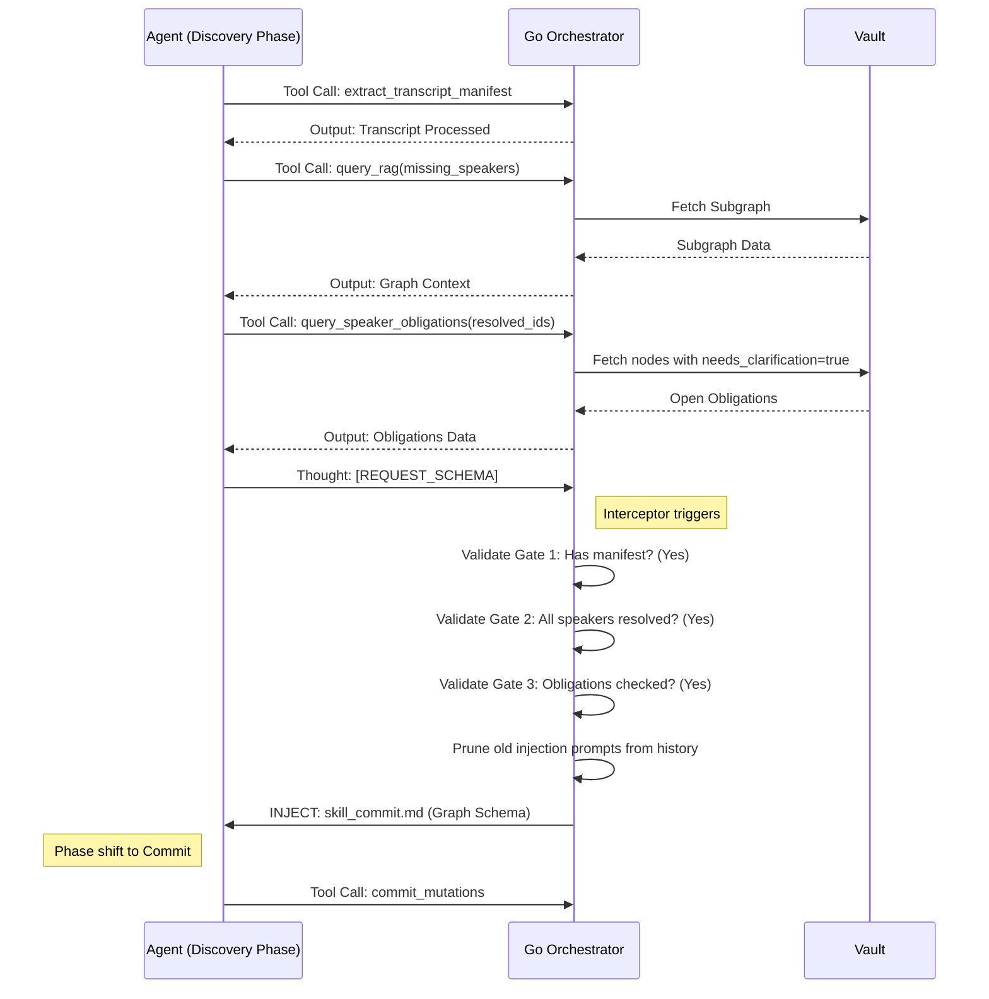

# The Agent Orchestrator & Interceptor Gates

> [!IMPORTANT]
> The AI Agent (`skill_discovery` and `skill_commit`) does **not** have full autonomy over the ingestion lifecycle. It is heavily gated by the Go Orchestrator (`internal/agent/orchestrator.go`), which enforces strict checks before allowing the agent to proceed to the next phase.

## The Interceptor Pattern

To prevent context window degradation and maximize Recency Bias, Alfred uses an **Additive-with-Pruning** dynamic injection architecture within the ReAct loop.

## The Three Strict Gates

When the Orchestrator intercepts the `[REQUEST_SCHEMA]` token in the LLM's thought block, it runs three validations:

1. **Gate 1: Manifest Validation**
   - **Condition:** `state.HasExtractedManifest == true`
   - **Failure Action:** Rejects the schema request. The LLM is forced to call `extract_transcript_manifest` first.

2. **Gate 2: Speaker Resolution**
   - **Condition:** Every `speaker` found in the manifest must exist as a resolved UUID in `state.ResolvedSpeakers`.
   - **Failure Action:** Rejects the schema request and explicitly tells the LLM which speakers are missing. The LLM must call `query_rag` and supply a `target_speakers` array matching the exact length of its queries to resolve them.

3. **Gate 3: Temporal Obligations Check**
   - **Condition:** `state.HasQueriedObligations == true`
   - **Failure Action:** Rejects the schema request. The LLM must call `query_speaker_obligations` to check if any of the speakers it just resolved have outstanding `needs_clarification: true` nodes. This guarantees the LLM will attempt `UPDATE_NODE` instead of hallucinating duplicate tasks.

4. **Gate 4: Schema Hallucination Prevention (Strict JSON Parsing)**
   - **Condition:** The JSON payload in `commit_mutations` must exactly match the expected Go struct fields.
   - **Mechanism:** The Orchestrator uses `json.NewDecoder(bytes.NewReader(byteArgs)).DisallowUnknownFields()`.
   - **Failure Action:** If the LLM hallucinates nested arrays, invents new fields, or fails to wrap mutations inside `{"arguments": {"mutations": [...]}}`, the Go decoder throws a `json: unknown field` error. The Orchestrator intercepts this and feeds it directly back into the ReAct loop as a Tool Error, forcing the LLM to instantly self-correct its payload structure.
   > **Note on Properties Validation Gap:** `DisallowUnknownFields()` does not recursively validate the inner `properties` `map[string]interface{}`. This means if the LLM hallucinates keys inside the `properties` map, they are silently ignored rather than triggering an error. This is a known issue.

5. **Gate 5: Invariant Data Operations (No Circle Creation)**
   - **Condition:** `node_type != "Circle"` when `operation == "CREATE_NODE"`.
   - **Failure Action:** Hard-rejects the payload with a specific error explicitly stating: *"Inline Circle creation is currently STRICTLY FORBIDDEN... You MUST capture the reference in the group_mentions array"*. This absolute, mechanical guardrail prevents the LLM from defying Layer 1 Mention Capture rules.

Only when all gates pass does the Orchestrator execute the final database transaction.

## Prompt-Level Constraints

While the Go Orchestrator manages the phase transitions, the actual generation of mutations is governed by strict, formalized Thought structures required within `skill_commit.md`:

1. **`ROLE CHECK`**: Forces explicit determination of execution burden before creating `ASSIGNED_TO` vs `MENTIONED_IN` edges.
2. **`EVENT CHECK`**: Demands a two-keyword threshold match before associating tasks with overarching events.
3. **`CLARITY CHECK`**: Structurally forces the LLM to verify Who/What/When/Why completeness to determine `needs_clarification`.
4. **`UPDATE CHECK` (Topic Alignment Constraint)**: Before any `UPDATE_NODE` is issued for an existing unclarified node, the LLM MUST explicitly query: `Does the overarching topic of this node match the transcript?` This prevents cross-topic data bleeding (e.g., merging "Reimbursement" details into a "Welcoming Speech" event simply because the speakers overlap).
